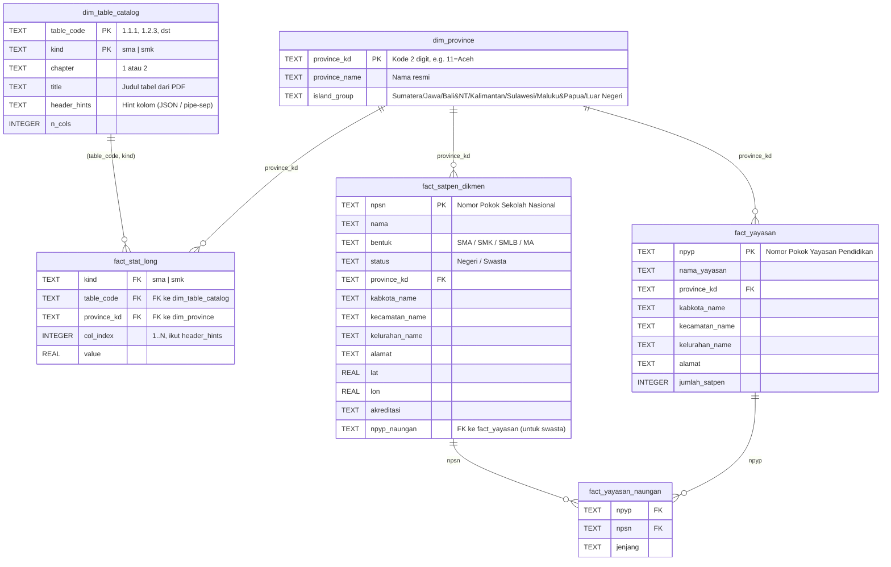

# SEKBER DIKMEN 2025 — Database Schema Reference

> **File**: `database/dikmen_master.db`
> **Engine**: SQLite 3 (compatible dengan Excel Get Data, DBeaver, datasette, Python `sqlite3`, Node `better-sqlite3`).
> **Star schema**: 2 dimensi (`dim_*`) + 4 fakta (`fact_*`) + 2 views.
> **Linkage policy**: Tindakan 1 ↔ 2 via **NPSN + alamat hierarchy**; Tindakan 1&2 ↔ Tindakan 3&4 via **province_kd**.

---

## 1. Entity Relationship Diagram



---

## 2. Linkage Rules (Penting!)

### Linkage A: Tindakan 1 ↔ Tindakan 2

Satuan pendidikan swasta (Tindakan 1) berafiliasi dengan yayasan (Tindakan 2) melalui jembatan `fact_yayasan_naungan`:

```sql
-- Sekolah swasta + yayasan pengelolanya
SELECT
  s.npsn, s.nama AS nama_sekolah, s.status,
  y.npyp, y.nama_yayasan
FROM fact_satpen_dikmen s
LEFT JOIN fact_yayasan_naungan yn ON yn.npsn = s.npsn
LEFT JOIN fact_yayasan y          ON y.npyp = yn.npyp
WHERE s.status = 'Swasta';
```

Untuk sekolah negeri, kolom `npyp_naungan` di `fact_satpen_dikmen` akan NULL — ini ekspektasi normal.

**View `vw_satpen_with_yayasan`** sudah men-pre-join ini untuk kemudahan query Excel.

### Linkage B: Tindakan 1&2 ↔ Tindakan 3&4

Statistik agregat PDF (Tindakan 3 & 4) terhubung ke data sekolah/yayasan via `province_kd`:

```sql
-- Bandingkan jumlah SMA aktual (dari scraping) vs statistik PDF (Negeri+Swasta Schools, kolom 1+7)
SELECT
  p.province_name,
  COUNT(DISTINCT s.npsn) AS actual_count,
  (SELECT SUM(value) FROM fact_stat_long
    WHERE kind='sma' AND table_code='1.1.2'
      AND province_kd = p.province_kd
      AND col_index IN (1, 7)) AS pdf_count
FROM dim_province p
LEFT JOIN fact_satpen_dikmen s
  ON s.province_kd = p.province_kd AND s.bentuk = 'SMA'
WHERE p.province_kd != '99'   -- exclude Luar Negeri jika perlu
GROUP BY p.province_kd
ORDER BY actual_count DESC;
```

### Linkage C: Alamat Hierarchy

Walau tidak FK formal, hierarki `province_kd → kabkota_name → kecamatan_name → kelurahan_name` di `fact_satpen_dikmen` dan `fact_yayasan` **harus konsisten** (string match). Audit di Section 5.

---

## 3. Schema DDL Reference

### `dim_province`
```sql
CREATE TABLE dim_province (
  province_kd  TEXT PRIMARY KEY,
  province_name TEXT NOT NULL,
  island_group TEXT NOT NULL
);
```
- Populasi: 39 baris (38 provinsi RI + "Luar Negeri" kd=99).
- `island_group` di-derive via `ISLAND_MAP` di `scripts/05_build_database.py`.

### `dim_table_catalog`
```sql
CREATE TABLE dim_table_catalog (
  table_code   TEXT NOT NULL,
  kind         TEXT NOT NULL CHECK(kind IN ('sma','smk')),
  chapter      TEXT,
  title        TEXT,
  header_hints TEXT,
  n_cols       INTEGER,
  PRIMARY KEY (table_code, kind)
);
```
- Populasi: 248 baris (122 SMA + 126 SMK).
- **Composite PK**: kombinasi `(table_code, kind)` — bug histori: PK awal hanya `table_code` menyebabkan SMA overwritten SMK; sudah di-fix.

### `fact_stat_long`
```sql
CREATE TABLE fact_stat_long (
  kind        TEXT NOT NULL,
  table_code  TEXT NOT NULL,
  province_kd TEXT NOT NULL,
  col_index   INTEGER NOT NULL,
  value       REAL,
  FOREIGN KEY (kind, table_code) REFERENCES dim_table_catalog(kind, table_code),
  FOREIGN KEY (province_kd)      REFERENCES dim_province(province_kd)
);
CREATE INDEX idx_stat_table ON fact_stat_long(kind, table_code);
CREATE INDEX idx_stat_prov  ON fact_stat_long(province_kd);
```
- Populasi: 138,316 baris (66,266 SMA + 72,050 SMK).
- Format **long** dipilih supaya skala kolom tabel PDF yang bervariasi (4 → 30+ kolom) bisa di-handle uniform.
- Untuk visualisasi, gunakan helper `statTablePivoted()` di `lib/db.ts` yang men-pivot ke wide format on-the-fly.

### `fact_satpen_dikmen` (Tindakan 1)
```sql
CREATE TABLE fact_satpen_dikmen (
  npsn            TEXT PRIMARY KEY,
  nama            TEXT,
  bentuk          TEXT,
  status          TEXT,
  province_kd     TEXT,
  kabkota_name    TEXT,
  kecamatan_name  TEXT,
  kelurahan_name  TEXT,
  alamat          TEXT,
  lat             REAL,
  lon             REAL,
  akreditasi      TEXT,
  npyp_naungan    TEXT,
  -- + 17 kolom detail lainnya (telp, email, kepsek, dll.)
  ...
);
CREATE INDEX idx_satpen_prov   ON fact_satpen_dikmen(province_kd);
CREATE INDEX idx_satpen_bentuk ON fact_satpen_dikmen(bentuk);
CREATE INDEX idx_satpen_status ON fact_satpen_dikmen(status);
```
- Target populasi: ±43,144 baris (setelah scraping Tindakan 1 selesai).

### `fact_yayasan` (Tindakan 2)
```sql
CREATE TABLE fact_yayasan (
  npyp           TEXT PRIMARY KEY,
  nama_yayasan   TEXT,
  province_kd    TEXT,
  kabkota_name   TEXT,
  kecamatan_name TEXT,
  kelurahan_name TEXT,
  alamat         TEXT,
  jumlah_satpen  INTEGER,
  ...
);
```
- Target populasi: ±148,693 baris.

### `fact_yayasan_naungan` (Bridge)
```sql
CREATE TABLE fact_yayasan_naungan (
  npyp    TEXT NOT NULL,
  npsn    TEXT NOT NULL,
  jenjang TEXT,
  PRIMARY KEY (npyp, npsn),
  FOREIGN KEY (npyp) REFERENCES fact_yayasan(npyp),
  FOREIGN KEY (npsn) REFERENCES fact_satpen_dikmen(npsn)
);
```

---

## 4. Views

### `vw_satpen_with_yayasan`
Pre-joined view untuk konsumsi Excel — setiap baris satuan pendidikan + info yayasan (NULL untuk negeri).

```sql
CREATE VIEW vw_satpen_with_yayasan AS
SELECT
  s.*,
  y.nama_yayasan,
  y.alamat AS alamat_yayasan
FROM fact_satpen_dikmen s
LEFT JOIN fact_yayasan_naungan yn ON yn.npsn = s.npsn
LEFT JOIN fact_yayasan y          ON y.npyp = yn.npyp;
```

### `vw_province_satpen_summary`
Ringkasan agregat per provinsi — KPI siap-pakai.

```sql
CREATE VIEW vw_province_satpen_summary AS
SELECT
  p.province_kd,
  p.province_name,
  p.island_group,
  COUNT(s.npsn) AS total_satpen,
  SUM(CASE WHEN s.status='Negeri' THEN 1 ELSE 0 END) AS total_negeri,
  SUM(CASE WHEN s.status='Swasta' THEN 1 ELSE 0 END) AS total_swasta,
  SUM(CASE WHEN s.bentuk='SMA'    THEN 1 ELSE 0 END) AS total_sma,
  SUM(CASE WHEN s.bentuk='SMK'    THEN 1 ELSE 0 END) AS total_smk
FROM dim_province p
LEFT JOIN fact_satpen_dikmen s ON s.province_kd = p.province_kd
GROUP BY p.province_kd;
```

---

## 5. Reference Queries

### Q1 — Top 10 provinsi berdasarkan jumlah SMK
```sql
SELECT province_name, total_smk
FROM vw_province_satpen_summary
ORDER BY total_smk DESC
LIMIT 10;
```

### Q2 — Negeri vs Swasta share per island group
```sql
SELECT
  island_group,
  SUM(total_negeri) AS negeri,
  SUM(total_swasta) AS swasta,
  ROUND(100.0 * SUM(total_negeri) / NULLIF(SUM(total_satpen),0), 1) AS pct_negeri
FROM vw_province_satpen_summary
GROUP BY island_group
ORDER BY pct_negeri DESC;
```

### Q3 — Pivoted statistik PDF (contoh: jumlah siswa SMA per provinsi, kolom 3 + 9 = Negeri Students + Swasta Students)
```sql
SELECT
  p.province_name,
  SUM(CASE WHEN f.col_index = 3 THEN f.value END) AS students_negeri,
  SUM(CASE WHEN f.col_index = 9 THEN f.value END) AS students_swasta,
  SUM(CASE WHEN f.col_index IN (3,9) THEN f.value END) AS students_total
FROM fact_stat_long f
JOIN dim_province p ON p.province_kd = f.province_kd
WHERE f.kind = 'sma' AND f.table_code = '1.1.2'
GROUP BY p.province_kd
ORDER BY students_total DESC;
```

### Q4 — Yayasan dengan satpen terbanyak
```sql
SELECT y.nama_yayasan, y.province_kd, COUNT(yn.npsn) AS n_satpen
FROM fact_yayasan y
JOIN fact_yayasan_naungan yn ON yn.npyp = y.npyp
GROUP BY y.npyp
ORDER BY n_satpen DESC
LIMIT 20;
```

### Q5 — Cross-tab bentuk × status (heatmap source)
```sql
SELECT bentuk, status, COUNT(*) AS n
FROM fact_satpen_dikmen
GROUP BY bentuk, status
ORDER BY bentuk, status;
```

### Q6 — Daftar SMK di kecamatan tertentu
```sql
SELECT npsn, nama, status, akreditasi, alamat
FROM fact_satpen_dikmen
WHERE bentuk = 'SMK'
  AND kecamatan_name = 'Cikarang Utara'
ORDER BY nama;
```

### Q7 — Gap analysis: provinsi dengan rasio swasta tertinggi
```sql
SELECT
  province_name,
  total_satpen,
  ROUND(100.0 * total_swasta / NULLIF(total_satpen,0), 1) AS pct_swasta
FROM vw_province_satpen_summary
WHERE total_satpen > 100
ORDER BY pct_swasta DESC
LIMIT 15;
```

---

## 6. Audit Queries

Jalankan setelah pipeline selesai (Sesi 9 di playbook).

### A1 — Cek `province_kd` NULL/invalid
```sql
SELECT 'fact_stat_long', COUNT(*) FROM fact_stat_long
  WHERE province_kd NOT IN (SELECT province_kd FROM dim_province)
UNION ALL
SELECT 'fact_satpen_dikmen', COUNT(*) FROM fact_satpen_dikmen
  WHERE province_kd IS NULL OR province_kd NOT IN (SELECT province_kd FROM dim_province)
UNION ALL
SELECT 'fact_yayasan', COUNT(*) FROM fact_yayasan
  WHERE province_kd IS NULL OR province_kd NOT IN (SELECT province_kd FROM dim_province);
```
Ekspektasi: semua 0.

### A2 — NPSN duplikat
```sql
SELECT npsn, COUNT(*) AS n FROM fact_satpen_dikmen GROUP BY npsn HAVING n > 1;
```
Ekspektasi: 0 baris.

### A3 — Yayasan tanpa satpen-naungan (mungkin yayasan non-pendidikan formal)
```sql
SELECT COUNT(*) FROM fact_yayasan y
WHERE NOT EXISTS (SELECT 1 FROM fact_yayasan_naungan yn WHERE yn.npyp = y.npyp);
```
Ekspektasi: bisa > 0 (yayasan PAUD/non-dikmen), tapi catat angkanya.

### A4 — Konsistensi catalog
```sql
SELECT kind, COUNT(*) FROM dim_table_catalog GROUP BY kind;
-- Ekspektasi: sma=122, smk=126
```

### A5 — Distribusi fact_stat_long
```sql
SELECT kind, COUNT(*), COUNT(DISTINCT table_code), COUNT(DISTINCT province_kd)
FROM fact_stat_long
GROUP BY kind;
-- Ekspektasi: ~66k SMA / ~72k SMK, 122/126 table codes, 39 provinces
```

### A6 — Tabel PDF dengan jumlah row provinsi ≠ 39 (anomali parsing)
```sql
SELECT kind, table_code, COUNT(DISTINCT province_kd) AS n_prov
FROM fact_stat_long
GROUP BY kind, table_code
HAVING n_prov < 39
ORDER BY n_prov;
```
Ekspektasi: 0 baris (semua tabel cover 39 provinsi).

---

## 7. Indeks Tambahan untuk Performa

Jika dashboard lambat, tambahkan:

```sql
CREATE INDEX IF NOT EXISTS idx_stat_lookup ON fact_stat_long(kind, table_code, province_kd);
CREATE INDEX IF NOT EXISTS idx_satpen_kabkota ON fact_satpen_dikmen(kabkota_name);
CREATE INDEX IF NOT EXISTS idx_yayasan_prov ON fact_yayasan(province_kd);
CREATE INDEX IF NOT EXISTS idx_naungan_npsn ON fact_yayasan_naungan(npsn);
```

`05_build_database.py` sudah membuat indeks utama. Tambahan ini opsional untuk workload spesifik.

---

## 8. Kontrak Data — "No Hallucination" Policy

Setiap angka yang muncul di dashboard atau output AI **harus** punya jalur traceable ke tabel di atas. Konkret-nya:

1. KPI di overview → `vw_province_satpen_summary` atau `fact_stat_long`.
2. Insights AI → context-injected dengan `kpiSummary()` + top-10 province, jadi LLM hanya **menarasikan** angka existing.
3. Policy brief / simulasi → prompt secara eksplisit melarang invent angka di luar context.

Jika ada angka yang muncul tapi tidak bisa di-trace dengan query SQL di atas, itu **bug** (likely hallucination) — laporkan via Github Issue dengan tag `data-integrity`.

---

**End of Schema Reference.**
